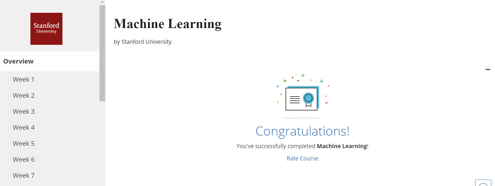

# ML-Coursera-Andrew-Ng
My solutions for Andrew Ng's Machine Learning Coursera Course, completed during the summer of 2020. It is an excellent introduction to machine learning, and I highly recommend it for anyone wanting to learn more about it.

I did not purchase the certificate, but here is a picture of my completion:

